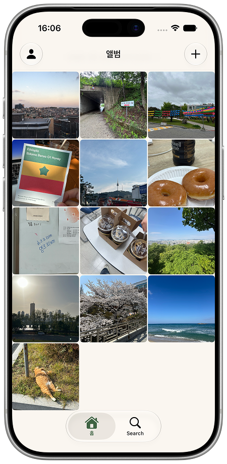
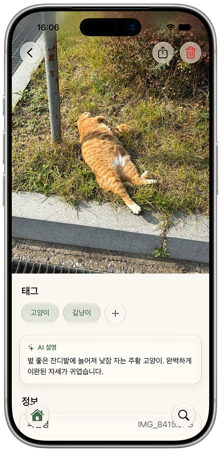
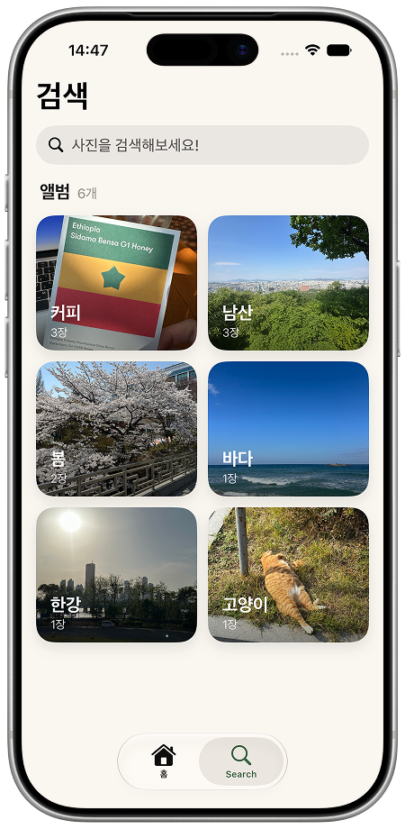

# Rephoto

고령층을 위한 AI 사진 관리 앱 — 사진을 올리면 AI가 자동으로 설명과 태그를 달아주고, 일상적인 문장으로 사진을 찾을 수 있습니다.


## 스크린샷

| 홈 | 사진 상세 | 자연어 검색 |
|:---:|:---:|:---:|
|  |  |  |

## 주요 기능

- **사진 업로드 + AI 분석** — 사진을 올리면 서버의 VLM이 자동으로 설명과 태그를 생성합니다. 여러 장을 선택하면 병렬로 업로드됩니다.
- **자연어 검색** — "바다에서 찍은 사진"처럼 문장으로 사진을 검색할 수 있습니다.
- **태그 앨범** — AI가 생성한 태그로 사진을 자동 분류해 앨범으로 보여줍니다.
- **태그 편집** — 사진 상세에서 태그를 직접 추가·수정·삭제할 수 있습니다.
- **민감한 사진 보호** — 개인정보나 문서가 포함된 사진은 홈에서 분리되고, Face ID 인증 후에만 볼 수 있습니다.
- **위치 정보** — 촬영 시점의 GPS 정보를 추출해 사진 상세에서 지도로 보여줍니다.

## 요구 사항

- iOS 26.0+
- Xcode 26.0+
- Swift 5

## 아키텍처

기능(Feature) 단위로 폴더를 나누고, 각 기능을 Data / Domain / Presentation 3계층으로 분리했습니다.

```
Rephoto_iOS/
├── App/              # 앱 진입점 (@main, ContentView)
├── Core/             # 공통 인프라
│   ├── Config/           # 환경 설정 (BASE_URL)
│   ├── DIContainer/      # Factory 기반 DI 컨테이너
│   ├── Error/            # 공통 에러 타입
│   └── NetworkAdapter/   # URLSession 기반 자체 네트워크 레이어
├── Features/
│   ├── Home/         # 사진 그리드 · 업로드 · 상세(태그/설명)
│   │   ├── Data/         # DTO · Repository 구현 · API Target
│   │   ├── Domain/       # UseCase · Model · Repository 인터페이스
│   │   └── Presentation/ # View · ViewModel
│   ├── Search/       # 자연어 검색 · 태그 앨범
│   └── User/         # 로그인 · 세션 · 설정
├── Resources/        # 에셋 · 공용 컴포넌트
└── Utilities/        # Keychain, Extensions
```

### 설계 패턴

- **Clean Architecture + MVVM** — View → ViewModel → UseCase → Repository 단방향 의존. Presentation은 Domain Model만 사용하고, DTO 매핑은 Data 계층에 격리됩니다.
- **Swift Concurrency** — `async/await` 전면 사용. 토큰 저장소와 네트워크 클라이언트는 `actor`로 구현해 동시 접근을 직렬화합니다.
- **자체 네트워크 DSL** — 엔드포인트를 `APITargetType` 프로토콜로 선언하면 `NetworkAdapter`가 `URLRequest`로 조립하고, `NetworkClient`(actor)가 Bearer 토큰 주입과 401 시 토큰 자동 갱신·재시도를 처리합니다.
- **의존성 주입** — Factory로 의존성을 등록하고, DEBUG 빌드에서는 Mock provider를 자동 주입해 SwiftUI Preview와 테스트를 네트워크 없이 격리합니다.

## 의존성

| 패키지 | 용도 |
|--------|------|
| [Factory](https://github.com/hmlongco/Factory) | 의존성 주입 |
| [Nuke](https://github.com/kean/Nuke) | 이미지 비동기 로딩 · 캐싱 |

## 라이선스

[MIT License](LICENSE) © 2025 Grit-23
